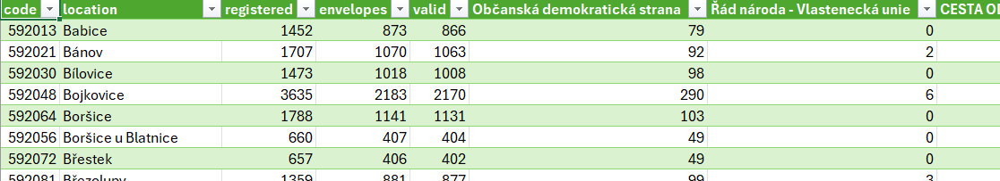

# **Elections scraper**

>Program _Elections scraper_ slouží k vytěžení volebních dat z webové adresy [volby.cz](https://www.volby.cz/pls/ps2017nss/ps3?xjazyk=CZ) za rok 2017 na úrovni obcí.

## **Příprava prostředí**

>Před samotným spuštěním programu je potřeba nainstalovat potřebné Python knihovny.  
>
>Soupis potřebných knihoven je uložen v přiloženém souboru _"requirements.txt"_ případně _"requirements_pip.txt"_  
>a jejich instalace se provede zadáním příkazů v terminálu.
>
>- PIP  
> `python -m pip install -r requirements_pip.txt`  
>
>- ANACONDA  
> `conda install --file requirements.txt`  

## **Spuštění**

>Spuštění programu se provádí v terminálu příkazem se dvěma argumenty v podobě  
>`python elections_scraper.py <'URL'> <'file_name.csv'>`  
>
>1. <'URL'>  
>    - první argument  
>    - jedná se odkazy označené "x" u "Výběr obce" na rozcestníku "Výsledky hlasování za územní celky – výběr územní úrovně"
>    - odkaz na konkrétní uzemní celek, ze kterého chceme získat výsledky voleb ze všech obcí.  
>Například pro Uherské Hradiště -> <https://www.volby.cz/pls/ps2017nss/ps32?xjazyk=CZ&xkraj=13&xnumnuts=7202>  
>    -odkaz musí být "obalen" v uvozovkách! (odkazy obsahují speciální znaky, které terminál nedokáže zpracovat)  
>
>2. <'file_name.csv'>  
>    - druhý argument  
>    - jméno souboru s příponou csv  
>    - např.: "vysledky_uherske_hradiste.csv"  

## **Ukázka**  

>`# spuštění`  
>`python elections_scraper.py "<https://www.volby.cz/pls/ps2017nss/ps32?xjazyk=CZ&xkraj=13&xnumnuts=7202>" vysledky_uherske_hradiste.csv`  
>
>`# běh programu`  
>_Scraping...-_
>
>_File 'vysledky_uherske_hradiste.csv' succesfuly created with requested elections data._  
>_Program terminated_  
>
>`# výsledek`  
>
>| code | location | registered | envelopes | valid | Občanská demokratická strana |
>| ---- | -------- | ---------- | --------- | ----- | ---------------------------- |
>| 592013 | Babice | 1 452 | 873 | 866 | 79 |
>| 592021 | Bánov | 1707 | 1070 | 1063 | 92 |
>
>---
>
>  

## **KONEC**  
